# Report for Final Project
Light-field Camera Implementation

Digital Image Synthesis, Fall 2016

DEADLINE: 01/17/2017,23:59

INSTRUCTOR: Yung-Yu Chaung

b03902027 (Kuan-Chun Wang) 

## Outline
1. Abstract
2. Introduction
3. Implementation details
4. Results
5. Building and running the modified pbrt
6. Other notes and future works
7. Acknowledgements & References

### Abstract
In this project, I attempted to implement a novel design of camera called the plenoptic camera (or, light-field camera), which is introduced by Ren Ng et al. in 2005. Such a camera, unlike traditional ones, will save not only light power data on every pixel, but also the directions of all lights toward every pixel. With the additional information of the light directions, we are able to roughly synthesize films at different positions in the camera space of pbrt (i.e. refocusing).

### Introduction
A light field is a physical field that is subject to the influence from lights (visible electromagnetic rays). A light-field camera is a camera which tries to capture the light field on a 2D film plane, and thus the captured field can be expressed as a 4D function L(s, t, u ,v), where (s, t) represents a spacial point on the film plane, and (u, v) represents the angles of lights that hit on the film; in total, L(s, t, u, v) returns the energy of the light power on point (s, t) which is given from the light from the direction (u, v). To capture the light field, the physical implementation replaces the film in traditional cameras with an array of "microlens", and place a photosensor in the back to detect the lights from every valid direction. Then such camera will use software to perform refocusing with those data and output images with different focuses. 

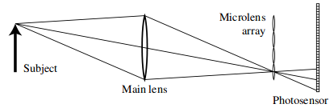

### Implementation details
According to the structure of the light-field camera introduced in the papers, to implement a light-field camera in pbrt, one should attempt to save 4D field data from the camera and, reconstruct the images on synthestic films according to the light field generated from the camera. Recall that I've successfully implemented a realistic camera in pbrt in homework 2. In this project, I tried to add a new class, called "LightfieldCamera", which is extended from the realistic camera that I created in homework 2. In LightfieldCamera, unlike what a realistic camera does, it simulates its film as the microlens array of the real light-field camera, and after rendering the lightfield image, it uses the image to create synthesized images with given position, which is the simulation of the software implementation of the physical camera.

#### Capturing light field data
To simulate the normal film to the microlens, I changed the sampling method within the realistic camera. In the realistic camera, when the sampler samples a point on the raster space, it transforms it into the camera space, and uniformly samples another point on the last len of the realistic lens set. Unlike above, in light-field camera, I mapped every microlen linearly to the main lens, since in my implementation, every microlen records lights from all valid directions to a single pixel (pretend that every microlen repersents a pixel). Doing so will guarantee that lights from all different directions from the main lens will be recorded.

The following is the raw lightfield data modified from the scene "dof-dragons.dgauss.pbrt" (provided in homework 2) with 16 samples per pixel, and with microlen size = 8x8. Every dots seen in the image represents the light power captured within a single microlen.

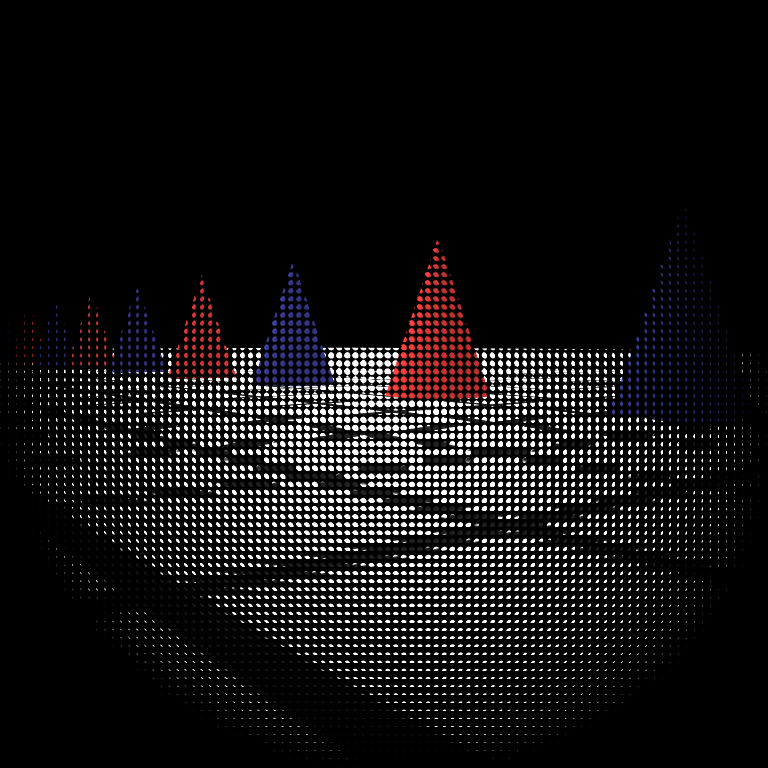

And the following is the rearrangement (or "montage") of the raw data, which is achieved by placing every same (u, v) form all microlens  together. Since the microlen size is 8x8 above, there should be 8x8 subimages in this image. What's interesting is that every subimage seems to represent a result with a slightly moved perspective.

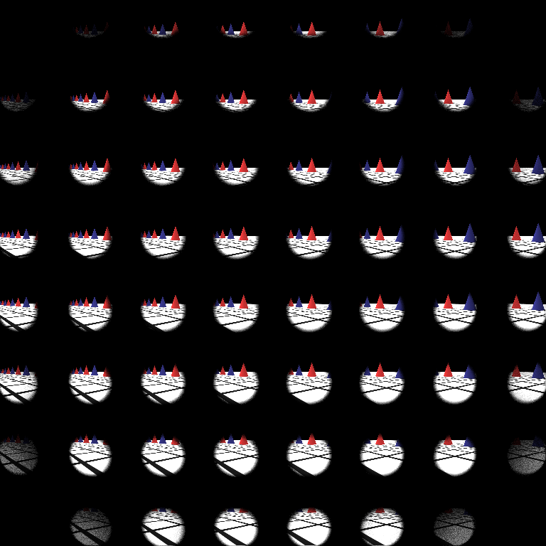

#### Synthetic refocusing
After the raw light-field image is generated, one can resample the light-field given the raw image to generate refocused images on the synthestic films between the main lens and the microlens array. In this step, I sampled points on the main lens (u, below) for every pixel on the synthestic films (s'), and then decide the power contribution according to the light field image (s). In my implementation, I defined a value "alpha" which represents the ratio between the distance of the main lens to the synthetic film and the distance of the main lens to the microlens array. 

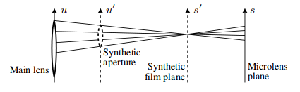

However, my current implementation is rather naive; I just simply sample some points deterministically on the main lens, rather than applying other more sophisicated sampling methods. Furthermore, I only implemented a 2D interpolation on (s, t) (the lightfield function is L(s, t, u, v)) (this is also due to my simple sampling method on (u, v) noted just above).

#### Modification on the scene file (.pbrt)
Compared with realistic cameras, a light-field camera requires additional parameters to be defined in the scene description. In my implementation, the film resolution represents the resolution of the raw light field image. In the declaration of the camera, there are two parameter added: "microlens_diameter" represents the diamater of every microlen and "alpha" represents an array of alpha values, and the modified system will render images on synthetic films with different alpha values respectively, and their resolutions will be (xresolution/microlens_diameter)x(yresolution/microlens_diameter).

### Results
The following are the results of the scene dof-dragons.dgauss.lightfield.pbrt (raw 2048x2048, 16 samples, filmdistance = 36.77 (the focal length of the given gaussian lens set), microlens_diameter = 8, alpha = 0.99, 0.90, 0.80, 0.70). The left images are the images synthesized from the light field with alpha value (0.99, 0.90, 0.80, 0.70), respectively, and the right ones are the images directly rendered with realistic cameras (256x256, 128 samples) with different filmdistances (36.77, 33.09 = 36.77*0.9, 29.42 = 36.77*0.8, 25.74=36.77*0.7). In my opinion, the more similar the two images are, the better the result is.

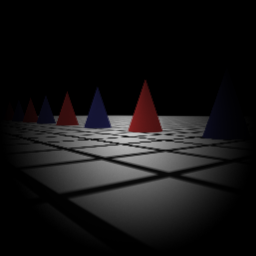
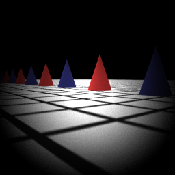

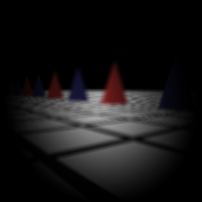
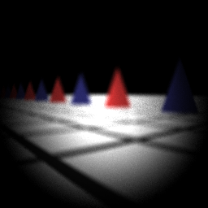

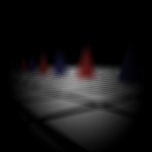
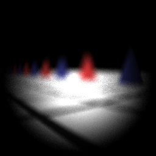

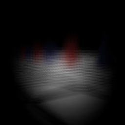
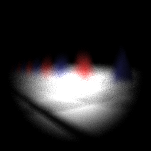

From above, we can learn that the smaller the alpha value is (i.e. the synthetic film plane is closer to the main lens), the larger differences appears. When alpha is high, the synthesized images seem to have little differences, while when alpha decreases more, the images seem to become more different than the one generated by realistic cameras.

#### Additional results

The results below are the comparison when the filmdistance of the light-field camera is 40.45 (= 1.1*36.77), given alpha = 0.99, 0.91, 0.82, and the filmdistance of the realistic camera are 40.45 (= 1.1*36.77), 36.77 (= 0.91*40.45), 33.09 (= 0.98*40.45) respectively. The left images are synthesized from light-field camera, and the right ones are rendered with realistic camera.

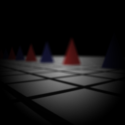
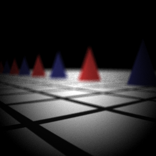

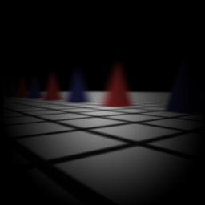

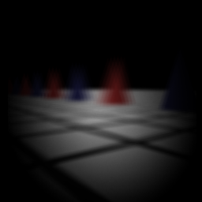

Something interesting is that, when alpha is 0.91, the grids on the ground is clearer than the image with alpha = 0.99, while the triangles aren't. 

The overall results are not desirable enough and may have some rooms of improvement. Though in a certain range of alpha values, the results are good enough, but my aim is to increase the quality of the images above to a certain level, which may require more study in the future.

### Building and running the modified pbrt
I tested the modified pbrt in linux. The file I added and modified are listed below:

src/core/api.cpp          (modified)

src/film/image.cpp        (modified)

src/film/image.h          (modified)

src/camera/realistic.cpp  (directly from hw2)

src/camera/realistic.h    (directly from hw2)

src/camera/lightfield.cpp (newly added)

src/camera/lightfield.h   (newly added)

Simply add all of them to pbrt and recompile them.

### Other notes and future works

Due to limited available time thanks to numerous other finals, I have some more stuffs would like but haven't done yet. Here are some improvements and works to do for this project in the future. I'll list them below:

1. A better method for synthestic refocusing
2. Parallel/faster refocusing algorithms (The synthestic refocusing can be done parallelly)
3. Synthesize images with different perspectives (I've heard that light-field cameras are capable to do this)

### Acknowledgement & References

#### Acknowledgements

I would like to thank the 2nd prize winners in the 2014 Stanford Rendering Competition for their reports, which gave me some information to implement this project more easily; and b03902028, who is also taking this course, for discussing together. Fianlly, I'd like to thank the instructor and the TA in this course for teaching and reading my homework / project report, as well as the authors of pbrt.

#### References

1. Ng, R. et al., P. 2005.  Light field photography with a hand-held plenoptic camera. Computer Science Technical Report CSTR 2, 11. (paper available at http://graphics.stanford.edu/papers/lfcamera/lfcamera-150dpi.pdf)

2. Hossain, Z. et al., CS348b Project: Light Field Camera Simulation (http://graphics.stanford.edu/courses/cs348b-competition/cs348b-14/second_report.pdf)

3. "Light-field camera", Wikipedia. (https://en.wikipedia.org/wiki/Light-field_camera)
